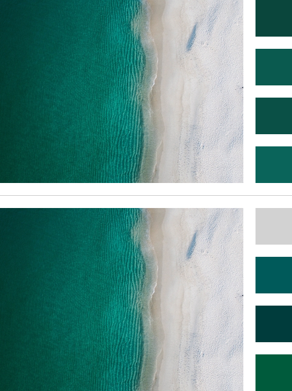
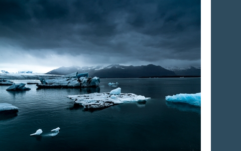
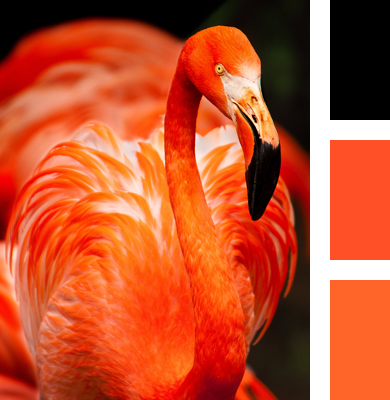

# Color.js 🎨

Extract colors from an image using JavaScript. Images that are already present in the DOM are supported, as well as (external) URL's. Size: 1,6kb (gzip).

## Install

Yarn:

```sh
yarn add color.js
```

NPM:

```sh
npm install color.js --save
```

Manually:

```html
<script src="dist/color.js"></script>
```

## Usage:

```js
const color = new Color('js-logo.jpg', {
  amount: 1
});

color.mostUsed(result => {
  console.log(result); // rgb(241, 221, 63)
});
```

## Browser support

Pretty much everything, except for IE10 and lower.

## Options

You can pass two arguments, an image and a configuration `object`.

### Image (required)

Can be a DOM element or URL.

```js
const img = document.getElementById('image');
const color = new Color(img);
```

```js
const color = new Color('image.jpg');
```

```js
const color = new Color('https://example.com/image.jpg');
```

When using an external image, [CORS](http://enable-cors.org/) should of course be enabled on the source.

### Configuration (optional)

The default configuration options. Explanations of each option can be found below.

```js
{
  amount: 3,
  format: 'rgb',
  sample: 10,
  group: 20,
}
```

#### Amount

Only applicable for [mostUsed](#most-used) & [leastUsed](#least-used).

The amount of colors that should be returned. When set to `1` a singular value is returned, otherwise an `array` of values.

#### Format

The format in which colors should be returned. Options are `'rgb'` (default), `'hex'` and `'array'`.

```js
'rgb(241, 221, 63)' // 'rgb'
'#f1dd3f' // 'hex'
[241, 221, 63] // 'array'
```

#### Sample

Configures how many pixels of an image should be processed. For example, a value of `20` means every 20th pixel is interpreted. A higher value means less accurate results, but better performance. An example of default sampling (`10`) on a 593x393 image:


#### Group

Only applicable for [mostUsed](#most-used) & [leastUsed](#least-used).

Configures how many similar colors should be combined into one color. A value of `1` would mean _every_ individual color would be considered, but this is often not ideal. Especially in photographs there's usually a lot of color data, and grouping colors could give more usable results. In the first example below, `group` is set to `5` and a lot of individual colors in the sea are returned. When more grouping is applied (`30` in the second example), the results become more distinct.



## API

### Average

Returns the average color of an image.

```js
color.average(result => {...});
```



### Most used

Returns the most used color(s) in an image. Can be requested as a single color or palette of colors (see [amount](#amount)).

```js
color.mostUsed(result => {...});
```



### Least used

Returns the least used color(s) in an image. Can be requested as a single color or palette of colors (see [amount](#amount)).

```js
color.leastUsed(result => {...});
```
